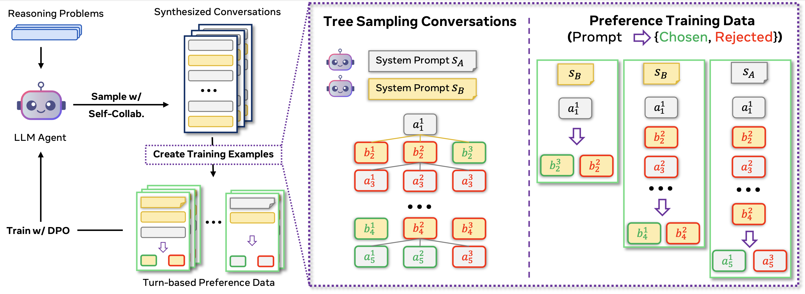

# Collaborative Reasoner

This is the codebase for the experiments of paper *"Collaborative Reasoner: Self-Improving Social Agents with Synthetic Conversations"* by Meta FAIR.



## Updates
* **2025-04-17**: Inital code release!

## Setup

### Installation
#### [Optional] Step 0: Create a conda env
We recommend `python>=3.10`
```bash
conda create -n coral python=3.10
```

#### Step 1: Clone the repo and install the dependencies
```bash
git clone git@github.com:facebookresearch/collaborative-reasoner
```

Make sure that you are in the root directory of the repo:
```bash
cd collaborative-reasoner
```

To install dependencies:
```bash
pip install -r requirements.txt
```
> [!WARNING]
> The dependencies in `requirements.txt` may not be an exhaustive list, you may need to install additional dependencies based on the errors (please open an issue/PR if that's the case).

If you want to use `wandb`, please change the entity and project in these following files:
* `lightning_modules/configs/common/api_inference_trainer.yaml`
* `finetuning/configs/dpo.yaml`
* `finetuning/configs/sft.yaml`

To maximally reproduce our results on MATH, we recommend you use the evaluation scripts from 
[this repo](https://github.com/vsubramaniam851/multiagent-ft). More specifically, put
all the `*.py` scripts in 
[this folder](https://github.com/vsubramaniam851/multiagent-ft/tree/main/multiagent-ft) 
under `libs/multiagent_ft/`, and the imports in `evaluators.match_evaluators` should work as expected.

#### Step 2: MATRIX and fairseq2
In addition to the dependencies that are specified in the `.gitmodules` and `requirements.txt`, this repo also rely on the following two frameworks:

**MATRIX**
As introduced in the paper, we develop [MATRIX](https://github.com/facebookresearch/matrix) as the backend multi-agent communication framework to facilitate evaluation of collaborative reasoning capabilities, as well as synthetic data generation. Please follow the installation and instruction from the MATRIX repo to properly set it up.

**fairseq2**
In this work, we use [fairseq2](https://github.com/facebookresearch/fairseq2) to train llama-3.1 models using instruction tuning and preference tuning recipes.
> [!NOTE]
> You are definitely welcomed to use other training frameworks, and you should still be able to use other parts of this repo for generating synthetic conversational data and evaluation.

Details on how to finetune llama models using `fairseq2` in this repo are in the separate [finetuning README](https://github.com/facebookresearch/collaborative-reasoner/tree/master/finetuning#readme).

### Data

Download the dataset from their original sources: 
* MMLU-Pro: https://huggingface.co/datasets/TIGER-Lab/MMLU-Pro
* GPQA: https://github.com/idavidrein/gpqa
* ExploreToM: https://huggingface.co/datasets/facebook/ExploreToM
* Hi-ToM: https://github.com/ying-hui-he/Hi-ToM_dataset

And them put them in the `data` folder:
```txt
collaborative-reasoner/data
├── math
├── mmlu_pro
├── gpqa
├── explore_tom
└── hi_tom
```

For specific dataset the `train/val/test` sets may be called differently, check the dataset specific `yaml` config files for details, they should be self-explanatory.

## Running Evaluation

Now we can talk about how can we run evaluations to measure the collaborative reasoning capabilities of LLMs. 

> [!TIP]
> Essentially the same workflow will be used for generating synthetic conversation data for training.

> [!TIP]
> We recommend you exporting the following environment variables for SLURM to your current shell: `SLURM_ACC`, `SLURM_QOS`. These will be imported and used in the python scripts as well.

### Start MATRIX cluster and workers
Run the following command to start a MATRIX cluster, add a worker and deploy the applications (using `Llama-3.1-8B-Instruct`) as an example:
```bash
# start matrix cluster and add one worker to the pool
matrix start_cluster --add_workers 1 --slurm "{'account': $SLURM_ACC, 'qos': $SLURM_QOS}"

# deploy Llama-3.1-8B-Instruct as an application with 8 replicas
matrix deploy_applications --applications "[{'model_name': 'meta-llama/Llama-3.1-8B-Instruct', 'min_replica': 8, 'app_name': '8B_grpc'}]"
```

For more options and cutomization of the applications, check out the [docs for matrix](https://github.com/facebookresearch/matrix?tab=readme-ov-file#advanced-deployment).

### Start Evaluation Experiment
After MATRIX applications are up and running (you can check with `matrix check_health --app_name 8B_grpc`), you can now query them in parallel to generate the conversations for evaluation purposes.

To make sure that all the paths can be found at runtime:
```bash
# make sure you are in the repo root dir
export PYTHONPATH=`pwd`:libs/multiagent_ft/multiagent_ft/
```

Then you can run any of the coral evaluations based on the `yaml` configs in `lightning_modules/configs`. For example, to run coral evaluation for MMLU-Pro, do:
```bash
export EXP_NAME=results/coral-mmlu_pro-llama3_1_8b_inst
python lightning_modules/trainer.py validate \
    --trainer lightning_modules/configs/common/api_inference_trainer.yaml \
    --model lightning_modules/configs/common/ts_interaction_model.yaml \
    --config lightning_modules/configs/ts_mmlu_pro.yaml
```
A summary table will be printed at the end of the evaluation, and for coral performance, we focus on the `agreement_correctness`.

> [!TIP]
> Setting `EXP_NAME` env var will tell the experiment code where to put the results. We put the results in `results/debug-tmp` if this is unset.

To run chain-of-thought baselines, you should do:
```bash
export EXP_NAME=results/coral-mmlu_pro-llama3_1_8b_inst
python lightning_modules/trainer.py validate \
    --trainer lightning_modules/configs/common/api_inference_trainer.yaml \
    --model lightning_modules/configs/common/ts_interaction_model.yaml \
    --config lightning_modules/configs/ts_mmlu_pro.yaml \
    --data.val_set_init_args.student_instruction simple_cot \
    --data.val_set_init_args.teacher_instruction simple_cot \
    --model.max_turns 1
```
For chain-of-thought performance, since there is no multi-agent, multi-turn conversation, we focus on `final_success_rate` when reporting performance.

### Evaluating with different models
All the examples above are shown using `Llama-3.1-8B-Instruct` as an example, and of course you can change the models to evaluate, with all the models that MATRIX supports (i.e., huggingface, OpenAI GPT, Gemini, etc). 

To switch to different models, you will need to change the following:
* The model will need to be deployed on MATRIX, and you can specify `{"app_name": <my_app_name>, "model_name": <my_model_name>}`;
* Then you can either manually change the model names and app names in `lightning_modules/configs/common/ts_interaction_model.yaml` and the task-specific configs, or more easily, add the following lines to your command to override it:
    ```bash
    --model.teacher_model <my_model_name>
    --model.student_model <my_model_name>
    --model.teacher_app_name <my_app_name>
    --model.student_app_name <my_app_name>
    ```

> [!NOTE]
> The naming of "teacher" and "student" is just a way to distinguish the agent that asked the question and the agent that gave the first response. There are no difference in the system prompt in the two agents, nor are they assigned these actual roles.

> [!TIP]
> Yes, you can use different models for different agents :) 

## Synthetic Data Generation and Training
> [!NOTE]
> As in evaluation, you need to have an active MATRIX cluster running, with the corresponding models being served to be able to continue in the section.

We wrote a consolidated script (`finetuning/iterative_training.py`) to unify the steps needed for training the vLLM model with synthetic data. 

Before using that, you will need to set the following two env vars:
* `ITER_EXP_HOME`: this is where the experiment results will be saved.
* `tokenizer_dir`: this is the location of the llama3_1 tokenizers, which can typically be found in the local huggingface cache (try `cd $HF_HUB_CACHE`).
* `FS2_ENV`: this is the name of the env where `fairseq2` is installed.

Here is an example to run synthetic data generation and training in one step:
```bash
python finetuning/iterative_training.py --model 8b --exp_name test_8b --dataset mmlu_pro
```

For troubleshooting and more details on the finetuning part, please check the training README [here](https://github.com/facebookresearch/collaborative-reasoner/tree/master/finetuning#readme).

## Contributing
Please refer to
[Contribution Guidelines](CONTRIBUTING.md) to learn how to format, test, and
submit your work.

If you have any questions, feel free open an issue!

## License
This project is MIT licensed, as found in the [LICENSE](LICENSE) file.